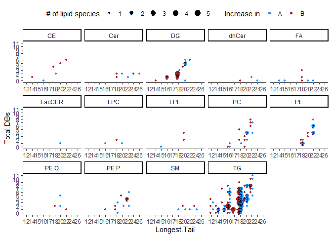

A tutorial on Lipid Structure Enrichment Analysis (LSEA)
================

### load package and example data

``` r
library(lsea)
# load example lipidomic composition data generated by adding random noise to real data
data(comp_data)
# load group labels (A or B) for differential testing and enrichment analysis
data(labels)
```

## CLR transformation

``` r
#transform composition data (features x samples) using centered log-ratio transformation
# note: this is not for normalized abundance data!!
clr_data <- lsea::clr.transform(comp_data)
```

## Differential composition testing

``` r
# to perform a paired t-test (samples must be ordered by pair)
t_df <- lsea::two.group.row.test(clr_data, labels, test = "t", paired = TRUE)
# to perform unpaired wilcox test
# note: wilcox test will throw warnings for every row with ties, so suppress those warnings
w_df <- suppressWarnings(lsea::two.group.row.test(clr_data, labels, test = "w", paired = FALSE))
```

##### t-test results ordered by p-value

|                |      stat |     mean1 |     mean2 |        dm |    pvalue |      padj |
|:---------------|----------:|----------:|----------:|----------:|----------:|----------:|
| TG 56:4-FA20:3 |  4.334250 |  2.168452 | -2.168452 |  4.336905 | 0.0001947 | 0.1738581 |
| TG 49:3-FA18:3 |  3.825307 |  2.280831 | -2.280831 |  4.561661 | 0.0007361 | 0.2324484 |
| TG 54:5-FA16:0 | -3.639901 | -1.953318 |  1.953318 | -3.906636 | 0.0011869 | 0.2324484 |
| FA 20:3        |  3.615850 |  1.678991 | -1.678991 |  3.357982 | 0.0012623 | 0.2324484 |
| TG 52:6-FA20:5 |  3.603903 |  1.856168 | -1.856168 |  3.712336 | 0.0013015 | 0.2324484 |
| PC 18:2_20:2   | -3.225378 | -1.399152 |  1.399152 | -2.798303 | 0.0033828 | 0.5034804 |

##### Wilcoxon test results ordered by p-value

|                |  stat |      mean1 |      mean2 |        dm |    pvalue |      padj |
|:---------------|------:|-----------:|-----------:|----------:|----------:|----------:|
| PC 16:1_18:1   | 624.0 |  1.6414554 | -1.6414554 |  3.282911 | 0.0000062 | 0.0055207 |
| FA 16:0        | 139.5 | -1.5086985 |  1.5086985 | -3.017397 | 0.0000831 | 0.0266629 |
| CE 18:1        | 140.0 | -1.6537323 |  1.6537323 | -3.307465 | 0.0000896 | 0.0266629 |
| PE P-16:0/16:1 | 581.0 |  1.3571488 | -1.3571488 |  2.714298 | 0.0001750 | 0.0390769 |
| TG 46:1-FA16:1 | 558.5 |  1.4270360 | -1.4270360 |  2.854072 | 0.0007628 | 0.1362407 |
| PE 18:0_18:1   | 554.5 |  0.6344112 | -0.6344112 |  1.268822 | 0.0009795 | 0.1457757 |

## LSEA

``` r
# we can use the t-statistic to rank lipid species and perform enrichment analysis using the GSEA algorithm
# note: the returned Wilcoxon statistic is not directional
res <- lsea::lsea(t_df, rnk_name = "stat")
```

##### Top 5 positive results

|     | pathway      |      pval |      padj |        ES |      NES |
|:----|:-------------|----------:|----------:|----------:|---------:|
| 104 | TG_UFA_12-16 | 0.0058939 | 0.4184676 | 0.4911824 | 1.706710 |
| 191 | UFA_12-16    | 0.0058939 | 0.4184676 | 0.4911824 | 1.706710 |
| 281 | TG_UFA_16    | 0.0384770 | 0.9106212 | 0.5313508 | 1.552093 |
| 40  | CE_SFA_22-26 | 0.0077427 | 0.4397856 | 0.9674523 | 1.490043 |
| 230 | PE.O_MUFA_18 | 0.0548523 | 0.9493974 | 0.8365140 | 1.438810 |

##### Top 5 negative results

|     | pathway           |      pval |      padj |         ES |       NES |
|:----|:------------------|----------:|----------:|-----------:|----------:|
| 153 | FA_12-16          | 0.0365757 | 0.9106212 | -0.7230966 | -1.550936 |
| 61  | HexCER_MUFA_22-26 | 0.0257019 | 0.9106212 | -0.7448246 | -1.597540 |
| 157 | HexCER_22-26      | 0.0257019 | 0.9106212 | -0.7448246 | -1.597540 |
| 277 | TG_SFA_18         | 0.0332673 | 0.9106212 | -0.6808962 | -1.605309 |
| 193 | CE_PUFA_18        | 0.0039801 | 0.4184676 | -0.9356382 | -1.609680 |
| 144 | CE_17-20          | 0.0046343 | 0.4184676 | -0.6904010 | -1.839914 |

### lipid species structure annotation

``` r
# LSEA works by annotating the provided lipid species based on their LIPIDMAPS-style name
lipid_anno <- lsea::annotate.lipid.species(rownames(t_df[order(t_df$pvalue),]))
```

| Species        | Class | Category            | Total.Carbons | Longest.Tail | Total.DBs | Saturation | Chain |
|:---------------|:------|:--------------------|--------------:|-------------:|----------:|:-----------|:------|
| TG 56:4-FA20:3 | TG    | Glycerolipid        |            56 |           20 |         4 | PUFA       | LCFA  |
| TG 49:3-FA18:3 | TG    | Glycerolipid        |            49 |           18 |         3 | PUFA       | LCFA  |
| TG 54:5-FA16:0 | TG    | Glycerolipid        |            54 |           16 |         5 | PUFA       | LCFA  |
| FA 20:3        | FA    | Fatty.Acyl          |            20 |           20 |         3 | PUFA       | LCFA  |
| TG 52:6-FA20:5 | TG    | Glycerolipid        |            52 |           20 |         6 | PUFA       | LCFA  |
| PC 18:2_20:2   | PC    | Glycerophospholipid |            38 |           20 |         4 | PUFA       | LCFA  |
| TG 52:4-FA18:2 | TG    | Glycerolipid        |            52 |           18 |         4 | PUFA       | LCFA  |
| CE 17:0        | CE    | Sterol              |            17 |           17 |         0 | SFA        | LCFA  |
| PE P-16:0/16:1 | PE.P  | Ether               |            32 |           16 |         1 | MUFA       | LCFA  |
| CE 18:1        | CE    | Sterol              |            18 |           18 |         1 | MUFA       | LCFA  |

### Visualizing differential lipid species enrichment

``` r
# for the purposes of this example we will raise the adjusted p-value threshold
lsea::structure.enrichment.plot(
  de_tbl = t_df, anno_tbl = lipid_anno, group_names = c("A", "B"),
  p_thresh = 0.75, color_pal = c("dodgerblue", "firebrick")
)
```

<!-- -->
